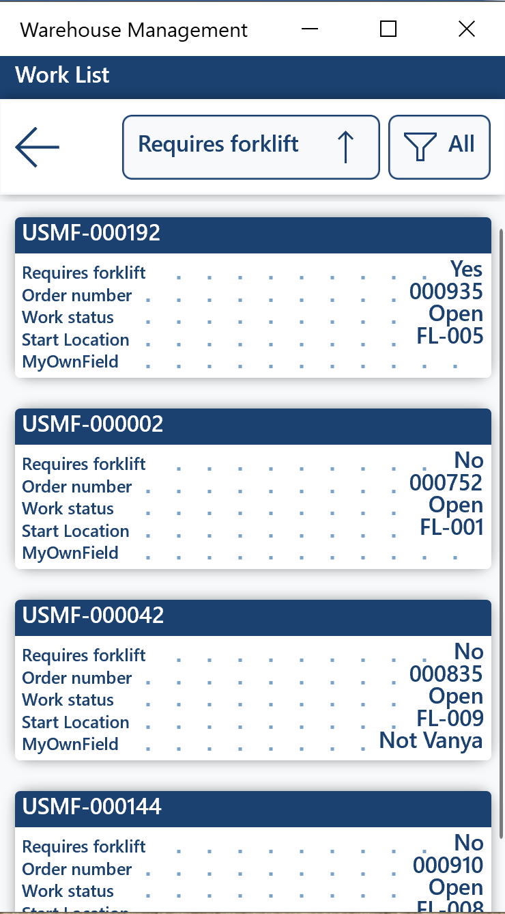
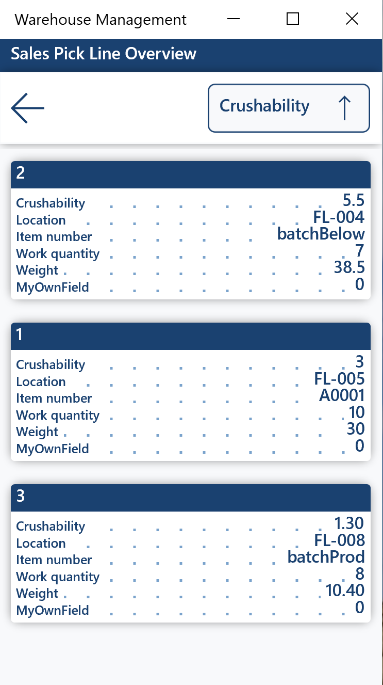

# Dynamics365SCM-WorkList-CustomizeDisplayFields
A small customization demonstrating how to customize fields that will be displayed on the mobile device in the Work list and Work picking line overview mobile device flows.

Here's how the custom fields look on the Work list:

Here's how the custom fields look on the Work pick line overview:

